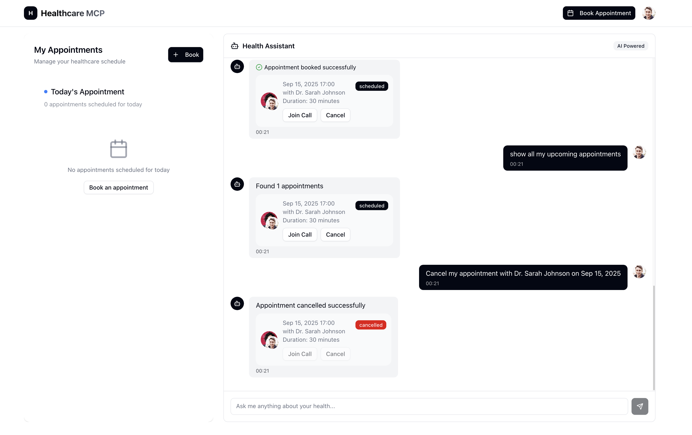

# Healthcare MCP - Learning Project for Conversational AI

A learning project that demonstrates how **Model Context Protocol (MCP)** can be used to create conversational interfaces for complex technical operations. This project explores how natural language chat can simplify database interactions and system management.

## 📸 Screenshots

### Application Overview


### Interactive Demo


## 🎓 Learning Objectives: Understanding MCP and Conversational AI

### What This Project Demonstrates

This is a **learning project** that shows how MCP (Model Context Protocol) can be applied to create more intuitive software interfaces. By leveraging MCP, we can build systems where:

- **Natural language** can be used to interact with databases and systems
- **Complex operations** can be simplified through conversational interfaces
- **AI agents** can handle technical complexity behind the scenes
- **User experience** can be improved by reducing the need for technical knowledge

### 🏥 Healthcare Domain Example

**Traditional Approach**: Users navigate through multiple screens, fill complex forms, understand database schemas, and perform technical operations.

**MCP-Powered Approach**: Users can interact through natural language chat that:
- Understands natural language requests
- Performs database operations through AI tools
- Manages appointments, therapists, and patient data
- Provides intelligent responses using RAG (Retrieval Augmented Generation)
- Handles technical complexity transparently

**Note**: This is a simplified demonstration. Real healthcare applications would require:
- HIPAA compliance and security measures
- Medical data validation and error handling
- Integration with existing healthcare systems
- Proper authentication and authorization

## 🧠 Backend Architecture: MCP Implementation

### Learning Focus: Conversational Database Operations

The backend demonstrates how MCP can be used to create conversational interfaces for database operations:

```typescript
// Traditional: Complex API calls, form submissions, technical interfaces
// MCP-Powered: Simple conversational requests

User: "Show me all available therapists for anxiety treatment"
AI: [Queries database, filters by specialization, returns formatted results]

User: "Book an appointment with Dr. Smith next Tuesday at 2 PM"  
AI: [Validates availability, creates appointment, updates database, confirms booking]

User: "Cancel my appointment tomorrow and suggest alternatives"
AI: [Finds appointment, cancels it, suggests available slots, updates all systems]
```

### MCP Server Implementation

The heart of the system is the **MCP Server** (`server/src/mcp/mcp-server.service.ts`) that:

1. **Exposes Database Operations as AI Tools**:
   - `list-therapists`: Natural language therapist discovery
   - `book-appointment`: Conversational appointment scheduling
   - `list-appointments`: Intelligent appointment management
   - `cancel-appointment`: Simple cancellation with alternatives
   - `get-profile`: Dynamic profile information retrieval

2. **Handles Complex Business Logic**:
   - JWT token validation and user authentication
   - Database relationship management
   - Data formatting and presentation
   - Error handling and user feedback

3. **Provides Intelligent Responses**:
   - HTML-formatted responses for rich UI display
   - Context-aware suggestions and alternatives
   - Automatic data refresh and synchronization

### Key Technologies

- **Backend Core**: NestJS, MongoDB, JWT Authentication
- **AI Integration**: OpenAI GPT, Langchain, ChromaDB for RAG
- **MCP Protocol**: Model Context Protocol for AI tool integration
- **Frontend**: Next.js 15, TypeScript, Tailwind CSS (supporting the conversational interface)

## 💡 Potential Benefits: How MCP Could Improve Team Productivity

### For Non-Technical Teams

**Traditional Systems**: 
- Require technical training to use complex systems
- Multiple clicks and form submissions for simple tasks
- Risk of making mistakes due to complexity
- Dependency on technical team members for basic operations

**Potential MCP Benefits**:
- **Natural language interaction** - could reduce technical knowledge requirements
- **Intelligent assistance** - AI could guide users through complex processes
- **Error prevention** - AI could validate requests and prevent mistakes
- **Self-service capabilities** - non-technical users could perform more operations independently

### Real-World Productivity Examples

```typescript
// Traditional: 5-10 steps, multiple screens, technical knowledge required
// MCP: 1 conversational request

"Find me all therapists who specialize in cognitive behavioral therapy 
and have availability next week, then book me with the highest-rated one"

// AI handles:
// 1. Database query with filters
// 2. Availability checking
// 3. Rating comparison
// 4. Appointment creation
// 5. Confirmation and scheduling
```

### Potential Business Impact

1. **Reduced Training Time**: Could reduce technical training requirements
2. **Increased Adoption**: Non-technical users might feel more confident using systems
3. **Faster Operations**: Complex tasks could potentially be completed more quickly
4. **Error Reduction**: AI validation could help prevent common mistakes
5. **Scalability**: AI assistants could potentially handle multiple users simultaneously

### Potential Technical Team Benefits

- **Focus on Business Logic**: Could reduce time spent on UI/UX for every operation
- **Rapid Prototyping**: New capabilities could be added through MCP tools
- **Maintenance Reduction**: AI could help with user guidance and error prevention
- **Scalable Architecture**: MCP tools could be reused across different interfaces

**Note**: These are potential benefits that would need to be validated in real-world implementations with proper security, compliance, and testing.

## 🚀 Getting Started

### Prerequisites

- Node.js (v18 or higher)
- pnpm package manager
- Docker and Docker Compose
- MongoDB (via Docker)
- OpenAI API key

### Installation & Setup

#### 1. Clone the Repository

```bash
git clone <repository-url>
cd healthcare-mcp
```

#### 2. Environment Setup

Create environment files for both server and client:

**Server Environment** (`server/.env`):
```env
MONGODB_URI=mongodb://localhost:27017/healthcare-mcp
JWT_SECRET=your-jwt-secret-key
OPENAI_API_KEY=your-openai-api-key
CHROMA_HOST=localhost
CHROMA_PORT=8000
```

**Client Environment** (`client/.env.local`):
```env
NEXT_PUBLIC_API_URL=http://localhost:3001
```

#### 3. Start Docker Services

```bash
# Start MongoDB and other services
docker-compose up -d
```

#### 4. Start the MCP Server

```bash
cd server
pnpm install
pnpm run start:dev
```

#### 5. Start the NestJS Server

```bash
# In a new terminal
cd server
pnpm run start:dev
```

The server will be available at `http://localhost:3001`

#### 6. Start the Client App

```bash
# In a new terminal
cd client
pnpm install
pnpm run dev
```

The client will be available at `http://localhost:3000`

## 📁 Project Structure

```
healthcare-mcp/
├── client/                 # Next.js frontend application
│   ├── src/
│   │   ├── app/           # App router pages
│   │   ├── components/    # React components
│   │   ├── stores/        # Zustand state management
│   │   ├── hooks/         # Custom React hooks
│   │   └── lib/           # Utility functions
│   └── package.json
├── server/                # NestJS backend application
│   ├── src/
│   │   ├── auth/          # Authentication module
│   │   ├── appointments/  # Appointment management
│   │   ├── patients/      # Patient management
│   │   ├── therapists/    # Therapist management
│   │   ├── chat/          # Chat functionality
│   │   ├── mcp/           # MCP server integration
│   │   ├── rag/           # RAG (Retrieval Augmented Generation)
│   │   └── scripts/       # Database seeding scripts
│   └── package.json
└── README.md
```

## 🛠️ Available Scripts

### Server Scripts

```bash
# Development
pnpm run start:dev

# Production
pnpm run start:prod

# Database seeding
pnpm run seed:therapists
pnpm run seed:patients

# Clear databases
pnpm run clear:databases

# Linting
pnpm run lint
```

### Client Scripts

```bash
# Development
pnpm run dev

# Production build
pnpm run build

# Start production server
pnpm run start

# Linting
pnpm run lint
```

## 🎯 Key Features

### Authentication System
- JWT-based authentication
- Secure password hashing with bcrypt
- Persistent login state with Zustand
- Protected routes and API endpoints

### AI-Powered Chat
- Natural language processing for healthcare queries
- Integration with OpenAI GPT models
- RAG (Retrieval Augmented Generation) for context-aware responses
- MCP (Model Context Protocol) for tool integration

### Appointment Management
- Browse available therapists
- Book appointments with date/time selection
- Cancel existing appointments
- Real-time appointment updates

### Modern UI/UX
- Responsive design with Tailwind CSS
- Component library with Shadcn/ui
- Dark/light theme support
- Smooth animations and transitions

## 🔧 MCP Implementation Deep Dive

### How MCP Transforms Database Operations

The MCP server (`server/src/mcp/mcp-server.service.ts`) acts as a bridge between natural language and database operations:

```typescript
// Example: MCP Tool Definition
{
  name: "book-appointment",
  description: "Book an appointment with a therapist",
  parameters: {
    therapistId: "string",
    date: "string", 
    time: "string"
  }
}

// AI automatically calls this tool when user says:
// "Book me an appointment with Dr. Smith next Tuesday at 2 PM"
```

### MCP Tools Available

1. **`list-therapists`**: 
   - Natural language: "Show me therapists for anxiety"
   - AI translates to: Database query with specialization filter
   - Returns: Formatted therapist list with HTML rendering

2. **`book-appointment`**:
   - Natural language: "Book appointment with Dr. Smith Tuesday 2 PM"
   - AI translates to: JWT validation + appointment creation
   - Returns: Confirmation with automatic UI refresh

3. **`list-appointments`**:
   - Natural language: "What are my upcoming appointments?"
   - AI translates to: User-specific appointment query
   - Returns: Formatted appointment list with actions

4. **`cancel-appointment`**:
   - Natural language: "Cancel my appointment tomorrow"
   - AI translates to: Appointment lookup + cancellation + alternatives
   - Returns: Confirmation with suggested alternatives

5. **`get-profile`**:
   - Natural language: "Show my profile information"
   - AI translates to: User data retrieval
   - Returns: Formatted profile with editable fields

### RAG Integration for Context-Aware Responses

The system uses ChromaDB for vector storage and retrieval:

```typescript
// RAG Service provides context for AI responses
- Stores healthcare knowledge and FAQs
- Retrieves relevant context for user queries
- Enhances AI responses with domain-specific information
- Maintains conversation history for better context
```

## 🔧 API Endpoints

### Authentication
- `POST /api/auth/register` - User registration
- `POST /api/auth/login` - User login

### Appointments
- `GET /api/appointments` - Get user appointments
- `POST /api/appointments` - Book new appointment
- `DELETE /api/appointments/:id` - Cancel appointment

### Therapists
- `GET /api/therapists` - Get all therapists

### Chat (MCP-Powered)
- `POST /api/chat` - Send chat message (triggers MCP tools)
- `GET /api/chat/history` - Get chat history

## 🗄️ Database Schema

### Patients
- Personal information (name, email, date of birth)
- Contact details (phone, address)
- Authentication credentials

### Therapists
- Professional information (name, specialization, experience)
- Contact details and availability
- Ratings and reviews

### Appointments
- Patient and therapist references
- Date, time, and duration
- Status tracking (scheduled, confirmed, completed, cancelled)
- Notes and cancellation reasons

## 🌟 MCP's Unlimited Automation Potential

The power of MCP lies in its ability to automate virtually any task by following the protocol. Once you understand the MCP pattern, you can create tools for unlimited automation scenarios:

### Common Automation Examples

**System Administration**:
- "Schedule a cron job to send daily reports every morning at 9 AM"
- "Set up automated backups for all databases every Sunday at 2 AM"
- "Create a monitoring alert when server CPU usage exceeds 80%"

**Marketing & Communications**:
- "Generate a marketing report for last month's campaign performance"
- "Send personalized emails to all customers who haven't purchased in 30 days"
- "Create and schedule social media posts for the next week"

**Data Management**:
- "Export all user data from the last quarter to CSV format"
- "Clean up old log files older than 90 days"
- "Update product prices based on the latest market data"

**Notifications & Alerts**:
- "Send Slack notifications when new orders are placed"
- "Email the team when a critical bug is reported"
- "Notify customers when their subscription is about to expire"

### The MCP Advantage

The beauty of MCP is that **any task can be automated** by simply:
1. **Following the MCP protocol** for tool definition
2. **Creating the appropriate backend logic** to handle the task
3. **Exposing it as an AI tool** that can be called through natural language

This means you're not limited to predefined use cases - you can create tools for any business process, system operation, or automation need by following the same pattern demonstrated in this project.

## 🚨 Important Notes

### Learning Purpose
This project is created for **educational and learning purposes only**. It demonstrates:
- **MCP Protocol Implementation**: How to build conversational AI systems
- **Backend Architecture**: NestJS with AI integration patterns
- **Database Operations**: MongoDB with conversational interfaces
- **RAG Integration**: How to use Retrieval Augmented Generation for intelligent responses
- **AI Tool Integration**: How to expose database operations as AI tools

### Not for Production Use
- This application is **not intended for production use**
- **No medical advice or diagnosis capabilities**
- **Security measures are basic** and for demonstration only
- **Data privacy and HIPAA compliance not implemented**
- **Uses third-party AI APIs** - production systems should use proprietary models

### For Production Implementation
If you want to use MCP in production, consider:
- **Use your own trained models** instead of third-party APIs
- **Implement proper security measures** and compliance requirements
- **Add comprehensive error handling** and validation
- **Include audit logging** and monitoring
- **Follow industry best practices** for data protection and privacy

## 🤝 Contributing

This is a learning project, but contributions and improvements are welcome:

1. Fork the repository
2. Create a feature branch
3. Make your changes
4. Test thoroughly
5. Submit a pull request

## 📝 License

This project is for educational purposes. Please ensure you comply with all applicable laws and regulations when using or modifying this code.

## 🔗 Related Technologies

- [Next.js](https://nextjs.org/) - React framework
- [NestJS](https://nestjs.com/) - Node.js framework
- [MongoDB](https://www.mongodb.com/) - Database
- [OpenAI](https://openai.com/) - AI services
- [MCP Protocol](https://modelcontextprotocol.io/) - AI tool integration
- [ChromaDB](https://www.trychroma.com/) - Vector database
- [Tailwind CSS](https://tailwindcss.com/) - Styling
- [Shadcn/ui](https://ui.shadcn.com/) - Component library
- [Zustand](https://zustand-demo.pmnd.rs/) - State management

---

**Happy Learning! 🎓**
